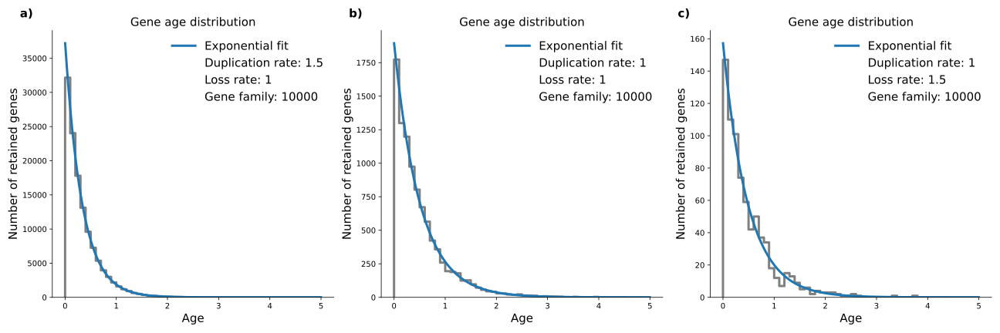
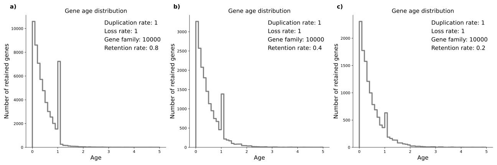

<div align="center">

# `evotree` : a python library of processing phylogenetic tree
**Hengchi Chen**

[**Installation**](#installation)
[**Illustration**](#illustration)
</div>

## Installation
The `evotree` package can be readily installed via `PYPI`. An example command is given below.

```
virtualenv -p=python3 ENV (or python3/python -m venv ENV)
source ENV/bin/activate
pip install evotree
```

Note that if users want to get the latest update, it's suggested to install from the source because the update on `PYPI` will be later than here of source. To install from source, the following command can be used.

```
git clone https://github.com/heche-psb/evotree
cd evotree
virtualenv -p=python3 ENV (or python3 -m venv ENV)
source ENV/bin/activate
pip install -r requirements.txt
pip install .
```

If there is permission problem in the installation, please try the following command.

```
pip install -e .
```
## Illustration

### Continuous-time birth-death Markov Chain Monte Carlo (MCMC) simulation

```
evotree simulatepbdmage
```



This figure shows the gene age distributions under a simple continuous-time birth-death Markov Chain Monte Carlo (MCMC) simulation of 10,000 gene families. Panel a shows the simulation with the duplication and loss rates as 1.5 and 1. Panel b shows the simulation with the duplication and loss rates as 1 and 1. Panel c shows the simulation with the duplication and loss rates as 1 and 1.5.

```
evotree simulatepbdmagewithwgd
```                                                                                                                                                


This figure shows the gene age distributions under a simple continuous-time birth-death MCMC simulation of 10,000 gene families with a WGD event aged at 1. The gene duplication and loss rates are both 1. Panel a shows the simulation with the retention rate as 0.8. Panel b shows the simulation with the retention rate as 0.4. Panel c shows the simulation with the retention rate as 0.2.
